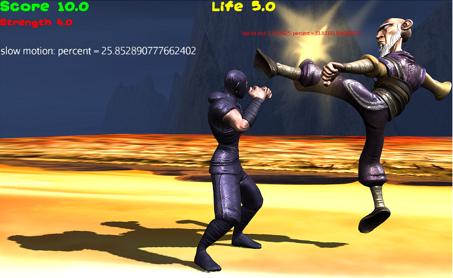

# grammar
SceneMax3D Syntax definition by ANTLR


This is the syntax definition of SceneMax3D programming language. 
For creating the lexer and parser for this language, use the attached **build.bat** file. Note that the parser is configured to use the **"Visitor"** design pattern approach.
The compiled product is a Java jar library named: **scenemax_parser.jar**
In your program, you can stream the code to the parser using the **parse()** method for example:

```java
String workingFolder = "c:\"; // set null for default current folder
String code = "var msg=\"hello world\"; d is a dragon ; d.fly loop; sys.print msg ;" ;
SceneMaxLanguageParser.parseUsingResource=false; // do not look for manual resource declarations
final ProgramDef prg = new SceneMaxLanguageParser(null, workingFolder).parse(code);
                
```                
